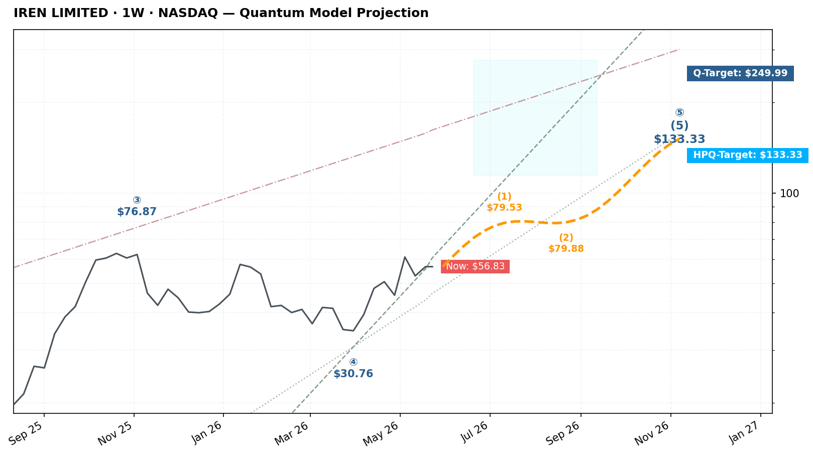

# $IREN — ElliottChart Quantum Model 实时追踪终端

> 📐 **引擎状态**: 视觉渲染已完成 TradingView **周线对数坐标轴（右侧价格轴刻度）** 级复刻。数浪预测投影已全面切换为**橙色虚线**，并对各浪位节点股价进行了精准标记。

### 📊 实时行情与空间度量
* **最新扫描时间**：自动同步最新 (UTC)
* **当前市场价格**：*等待 Workflow 下一次扫描自动刷新...*
* **形态解构状态**: 完美守稳宏观 Wave ④ 几何底线，当前正处于 **Primary Wave ⑤ 强力延伸阶段** 的多头孕育期。

### 🌊 Quantum Model Projection 宏观几何时空看板

---

### 📐 艾略特空间几何矩阵坐标
* **主情景计数**: 确认处于 Primary ⓪①②③④⑤ 宏观上攻大浪中。当前子浪 (1)-(2) 蓄势完毕，即将激活 (3) 浪加速上攻。
* **Q-Structure 支撑 Confluence 区**: 核心大周期绝对埋伏坑，执行机械式分批吸纳。
* **🔮 时空多头目标预期**: 
  - **第一高概率共振目标**: **$133.33**
  - **宏观扩展终极目标**: **$249.99**（预计在 24 周内时间窗口前后共振兑现）

### 📊 风险严防死守控制面板
| 结构坐标点 | 价格位 | 几何性质解析 | 战术机动预案 |
| :--- | :--- | :--- | :--- |
| **终极 Q-Target** | `$249.99` | 5浪多头时空扩展的极点 | 到达此处清空所有中线波段浮盈仓位 |
| **第一 HPQ-Target** | `$133.33` | 第一阶段量子共振点 | 开始无条件执行 50% 利润落袋策略 |
| **铁律止损线** | `Wave ④ 底部的 95%` | 结构彻底失效严控点 (2%) | 周线实体跌破无条件离场，承认模型解构 |

📜 *免责声明: All content reflects personal Elliott Wave + Quantum Model analysis and is not intended to serve as financial advice.*
